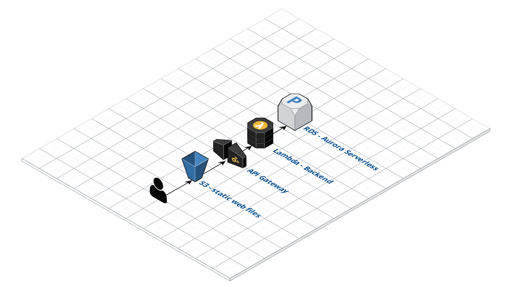
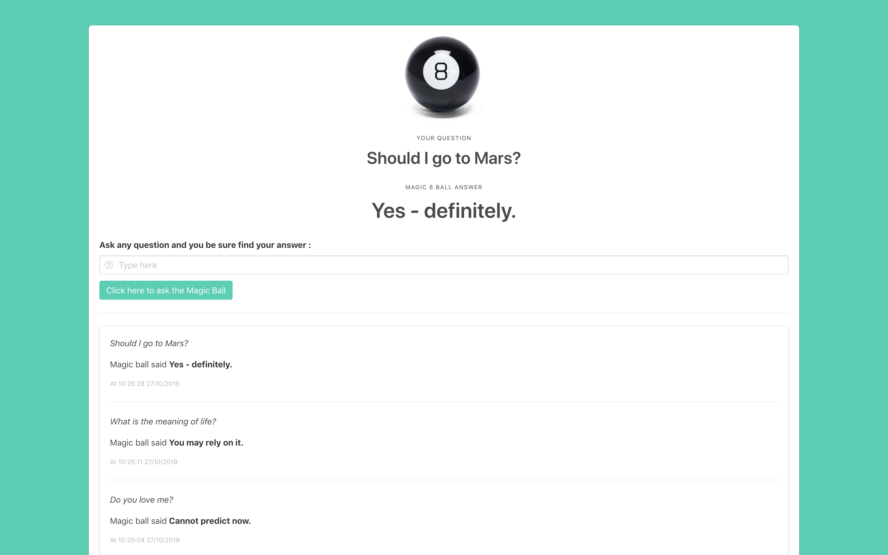

# MagicEightBall

A simple [Magic 8 Ball](https://en.wikipedia.org/wiki/Magic_8-Ball) Application made with Python 3 and only Serverless AWS Services ([Lambda](https://aws.amazon.com/lambda/), [Aurora Serverless](https://aws.amazon.com/rds/aurora/serverless/)).

All the services are launched via [CloudFormation](https://aws.amazon.com/cloudformation/) templates, see `iac/`



## Build the application 
`appname` is the name you want to give to your application:
```
python3 . appname run
```
And go to the URL provided at the end:
```
...

Now, go to http://appname-web-s3.s3-website-eu-west-1.amazonaws.com
```

## Destroy the application
```
python3 . appname destroy
```
## You will need to : 
* Configure a [aws cli](https://docs.aws.amazon.com/cli/latest/userguide/cli-chap-configure.html) account with admin access
* Install boto3: `pip3 install boto3`
* Run it inside an AWS Region where Data API for Serverless Aurora is deployed. It works well in Ireland or Northern Virginia.

